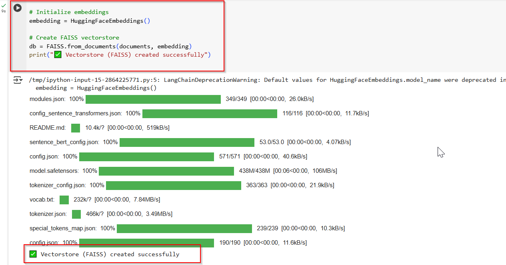
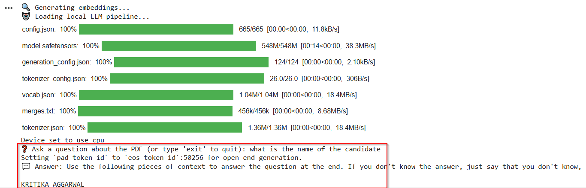
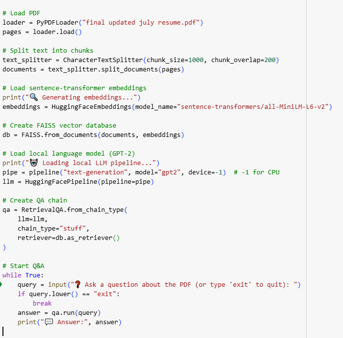
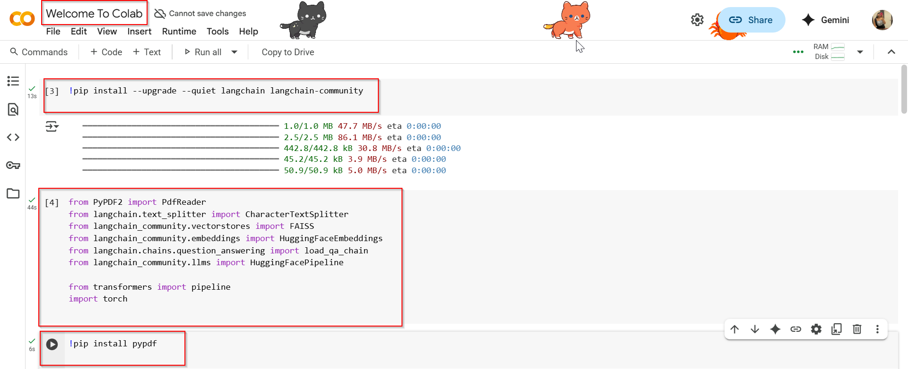

# 🤖 Agentic RAG Chatbot for Multi-Format Document QA using MCP

A Retrieval-Augmented Generation chatbot that uses **agent-based architecture** and **Model Context Protocol (MCP)** to answer questions from multi-format documents like PDF, DOCX, PPTX, CSV, and TXT.

---

## 🚀 Features

- ✅ Upload and parse documents of multiple formats
- ✅ Agent-based architecture with clear separation of concerns
- ✅ Semantic search using embeddings + vector DB
- ✅ Context-aware LLM responses
- ✅ Follows MCP for message passing between agents
- ✅ Streamlit UI for chatting and file upload

---

## 📸 Screenshots

### 1. Loading the PDF
This block loads and processes the content of the uploaded PDF file using `PyPDFLoader`.


---

### 2. Creating the FAISS Vectorstore
This screenshot shows how we create the vector embeddings using FAISS from the loaded document.



---

### 3. Q&A Interaction Output
This shows how the user inputs a question and receives a generated response from the chatbot.



---

### 4. Q&A Code Block
This screenshot shows the code responsible for running the actual Q&A logic using `chain.run()` or `ConversationalRetrievalChain`.



---

### 5. Initial Google Colab Setup
The first Colab cell, including installing dependencies and importing the necessary Python libraries.



---

## 🧠 Agentic Architecture

The system uses **3 core agents** communicating via **MCP-style JSON messages**:

User → UI → CoordinatorAgent
├──> IngestionAgent → Parses files
├──> RetrievalAgent → Embeds & fetches top chunks
└──> LLMResponseAgent → Generates final response
📦 **Sample MCP Message:**

```json
{
  "type": "CONTEXT_RESPONSE",
  "sender": "RetrievalAgent",
  "receiver": "LLMResponseAgent",
  "trace_id": "abc-123",
  "payload": {
    "top_chunks": ["..."],
    "query": "What are the KPIs?"
  }
}


🧰 Tech Stack
| Component        | Tool / Framework                          |
| ---------------- | ----------------------------------------- |
| UI               | Streamlit                                 |
| LLM              | OpenAI / HuggingFace                      |
| Embeddings       | Sentence Transformers                     |
| Vector Store     | FAISS / Chroma                            |
| File Parsing     | PyMuPDF, python-docx, pandas, python-pptx |
| Agents           | Python modules                            |
| Message Protocol | MCP (custom JSON structure)               |

🖥️ Supported File Formats
PDF

DOCX

PPTX

CSV

TXT 

⚙️ How to Run Locally
Clone the repo:
git clone https://github.com/your-username/Agentic-RAG-Chatbot.git
cd Agentic-RAG-Chatbot

Install dependencies:
pip install -r requirements.txt

Run the Streamlit app:
streamlit run app.py

Upload your files and start chatting! 💬

📊 PPT and Video
📝 Architecture PPT included in the repo

🎥 [Optional] Demo Video Link: (add after upload)

🚧 Challenges Faced
Parsing multiple file formats efficiently

Maintaining context relevance with semantic retrieval

Structuring agent communication via MCP

Managing chunk size, overlap, and context windows

🔮 Future Scope
Deploy on Hugging Face / GCP

Add file version tracking

Add authentication and save chat history

Use Redis pub/sub or Kafka for MCP

Add LangChain or LangGraph agents

📌 Author
Kritika Aggarwal
GitHub • LinkedIn

