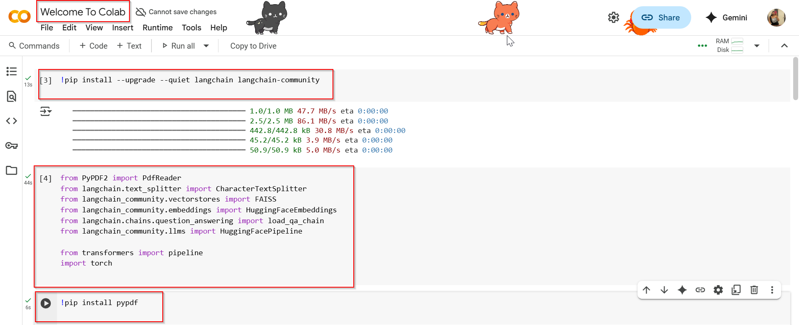
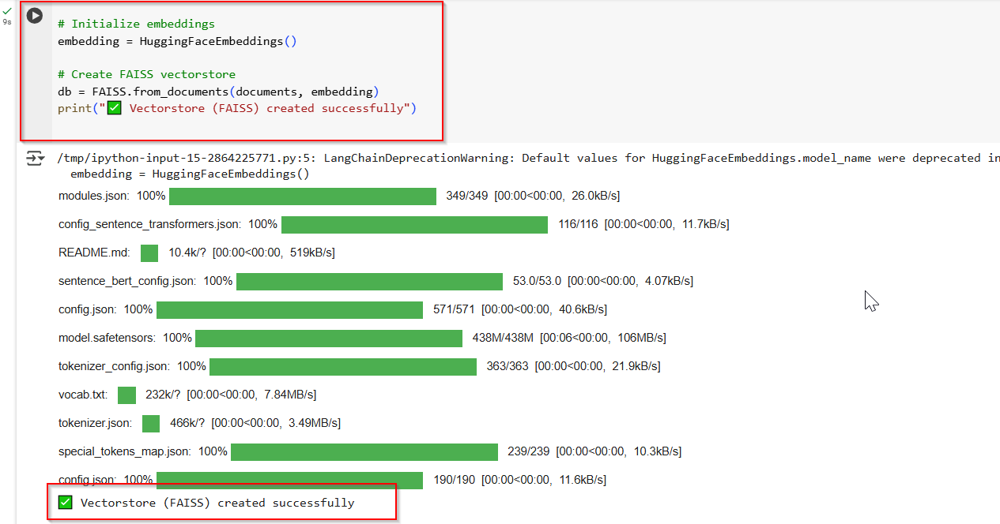
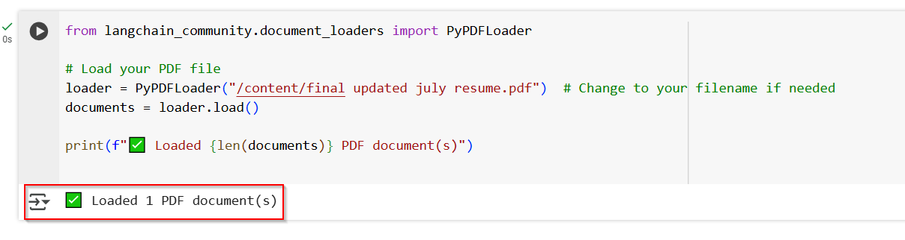
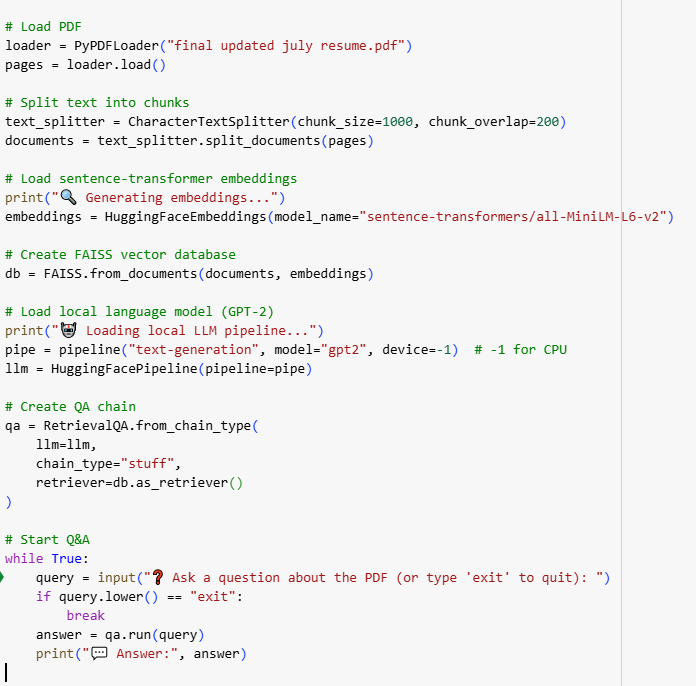
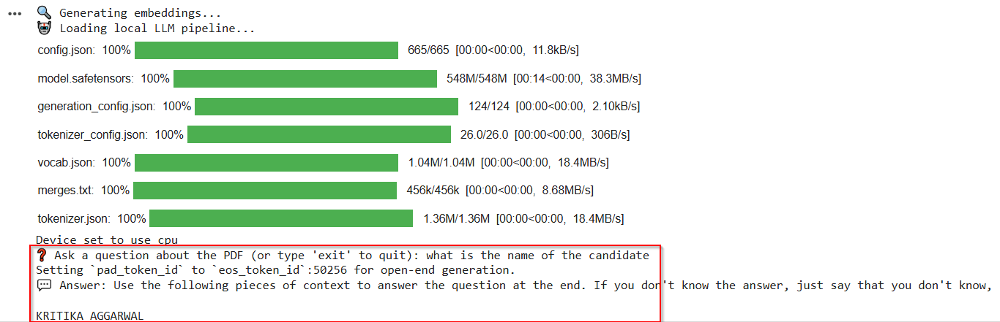

# 🤖 Agentic RAG Chatbot for Multi-Format Document QA using MCP

A Retrieval-Augmented Generation chatbot that uses **agent-based architecture** and **Model Context Protocol (MCP)** to answer questions from multi-format documents like PDF, DOCX, PPTX, CSV, and TXT.

---

## 🚀 Features

- ✅ Upload and parse documents of multiple formats
- ✅ Agent-based architecture with clear separation of concerns
- ✅ Semantic search using embeddings + vector DB
- ✅ Context-aware LLM responses
- ✅ Follows MCP for message passing between agents
- ✅ Streamlit UI for chatting and file upload

---

## 📸 Screenshots

### 🔹 Initial Setup


### 🔹 Creating Vector Store


### 🔹 Loading PDF


### 🔹 Q&A Code Block


### 🔹 Q&A Output in Streamlit


---

## 🧠 Agentic Architecture

The system uses **3 core agents** communicating via **MCP-style JSON messages**:
```
User → UI → CoordinatorAgent
├──> IngestionAgent → Parses files
├──> RetrievalAgent → Embeds & fetches top chunks
└──> LLMResponseAgent → Generates final response
```

## 📦 **Sample MCP Message:**
```
json
{
  "type": "CONTEXT_RESPONSE",
  "sender": "RetrievalAgent",
  "receiver": "LLMResponseAgent",
  "trace_id": "abc-123",
  "payload": {
    "top_chunks": ["..."],
    "query": "What are the KPIs?"
  }
}
```

## 🧰 Tech Stack
| Component        | Tool / Framework                          |
| ---------------- | ----------------------------------------- |
| UI               | Streamlit                                 |
| LLM              | OpenAI / HuggingFace                      |
| Embeddings       | Sentence Transformers                     |
| Vector Store     | FAISS / Chroma                            |
| File Parsing     | PyMuPDF, python-docx, pandas, python-pptx |
| Agents           | Python modules                            |
| Message Protocol | MCP (custom JSON structure)               |

## 🖥️ Supported File Formats
- PDF
- DOCX
- PPTX
- CSV
- TXT 

## ⚙️ How to Run Locally
- Clone the repo:
```
git clone https://github.com/your-username/Agentic-RAG-Chatbot.git
cd Agentic-RAG-Chatbot
```

- Install dependencies:
```
pip install -r requirements.txt
```

- Run the Streamlit app:
```
streamlit run app.py
```

## Upload your files and start chatting! 💬

## 🚧 Challenges Faced
- Parsing multiple file formats efficiently
- Maintaining context relevance with semantic retrieval
- Structuring agent communication via MCP
- Managing chunk size, overlap, and context windows

## 🔮 Future Scope
- Deploy on Hugging Face / GCP
- Add file version tracking
- Add authentication and save chat history
- Use Redis pub/sub or Kafka for MCP
- Add LangChain or LangGraph agents

## 📌 Author
### Kritika Aggarwal
### LinkedIn: https://www.linkedin.com/in/kritika-aggarwal-734997249/


