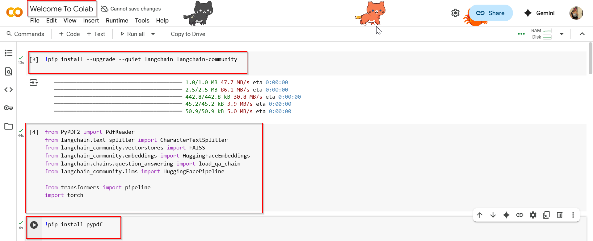
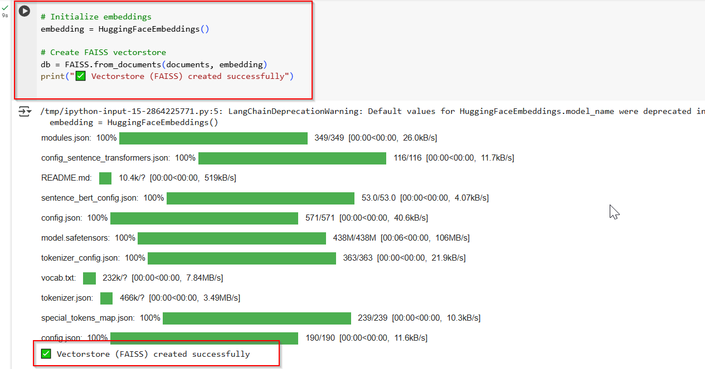
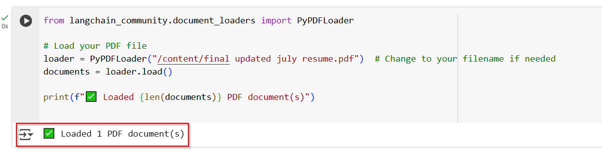
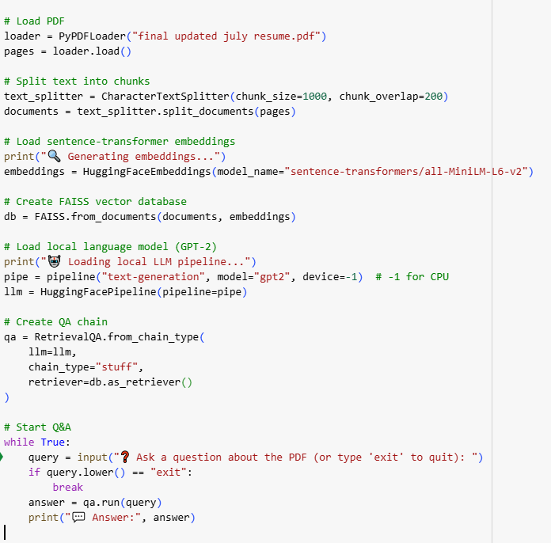
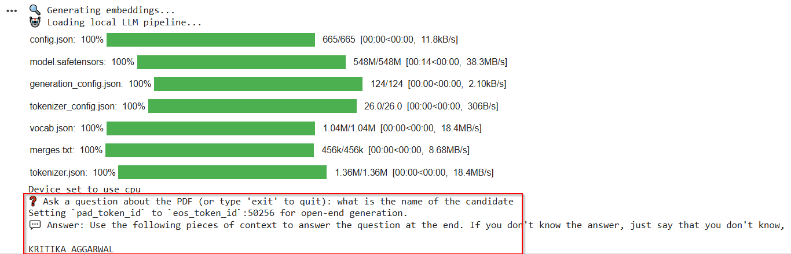

# 🤖 Agentic RAG QA System — Multi-Format Document Intelligence

A production-inspired **Retrieval-Augmented Generation (RAG)** system that answers natural-language questions from documents across multiple formats — PDF, DOCX, PPTX, CSV, and TXT.

Unlike typical monolithic RAG pipelines, this system uses an **agent-based architecture inspired by the Model Context Protocol (MCP)** — where each stage of the pipeline is a separate, communicating agent. This makes the system modular, debuggable, and closer to how real production AI systems are designed.

---

## 🚀 Live Demo

**Deployed on Hugging Face Spaces:**  
👉 [https://huggingface.co/spaces/kritikaaggarwal22/agentic-rag-chatbot](https://huggingface.co/spaces/kritikaaggarwal22/agentic-rag-chatbot)

### 🔹 Live App Screenshot


---

## 🚩 The Problem This Solves

Most RAG implementations are monolithic scripts — hard to debug, hard to extend, and far from production-ready.

This project answers: **what does a well-architected, agent-based RAG system actually look like in code?**

- You upload any combination of PDF, DOCX, PPTX, CSV, or TXT files
- The system parses, chunks, embeds, and indexes them automatically
- You ask questions in natural language
- Grounded, context-aware answers come back — with full traceability through structured agent messages

---

## ⚡ Key Features

- **Multi-format ingestion** — PDF, DOCX, PPTX, CSV, TXT parsed and normalised into a unified pipeline
- **Agent-based architecture** — Ingestion, Retrieval, and LLM Response agents with clean separation of concerns
- **MCP-style JSON message passing** — structured, traceable communication between agents
- **Semantic search** — sentence transformer embeddings + FAISS/Chroma vector store
- **Context-aware responses** — grounded LLM answers with retrieved chunks as context
- **Interactive Streamlit UI** — upload documents and query in real time
- **Configurable pipeline** — chunk size, overlap, top-k retrieval, and similarity threshold all tunable

---
## 📸 Screenshots

### 🔹 Initial Setup


### 🔹 Creating Vector Store


### 🔹 Loading PDF


### 🔹 Q&A Code Block


### 🔹 Q&A Output in Streamlit


---

## 📊 Performance

| Metric | Value |
|--------|-------|
| Supported formats | PDF, DOCX, PPTX, CSV, TXT |
| Evaluation accuracy | 85.7% (6/7 test cases) |
| Avg. retrieval latency | < 2s on local setup |
| Chunk size (default) | 500 tokens |
| Top-k retrieval (default) | 3 chunks |
| Vector store | Chroma (default) / FAISS |

---

## 🏗 System Architecture
```
User → Streamlit UI → Coordinator Agent
           ├── Ingestion Agent   → Parses, cleans & chunks documents
           ├── Retrieval Agent   → Embeds query & retrieves top-k chunks
           └── LLM Response Agent → Generates grounded final response
```

Agents communicate via **MCP-style structured JSON messages** — every interaction is typed, traced, and logged.

### Example Agent Message
```json
{
  "type": "CONTEXT_RESPONSE",
  "sender": "RetrievalAgent",
  "receiver": "LLMResponseAgent",
  "trace_id": "abc-123",
  "payload": {
    "top_chunks": ["..."],
    "query": "What are the KPIs?"
  }
}
```

---

## 🧰 Tech Stack

| Component | Tool |
|-----------|------|
| UI | Streamlit |
| LLM | OpenAI / HuggingFace |
| Embeddings | Sentence Transformers |
| Vector Store | FAISS / Chroma |
| File Parsing | PyMuPDF, python-docx, pandas, python-pptx |
| Message Protocol | MCP-inspired custom JSON |

---

## 🚀 Getting Started

### 1. Clone the repository
```bash
git clone https://github.com/KritikaK21/agentic-rag-qa.git
cd agentic-rag-qa
```

### 2. Create a virtual environment
```bash
python -m venv venv
source venv/bin/activate      # Mac/Linux
venv\Scripts\activate         # Windows
```

### 3. Install dependencies
```bash
pip install -r requirements.txt
```

### 4. Set up environment variables
Create a `.env` file in the root directory:
```
OPENAI_API_KEY=your_key_here
```

### 5. Run the app
```bash
streamlit run app.py
```

---

## 🔍 Retrieval Pipeline
```
Upload → Parse → Chunk → Embed → Store in FAISS/Chroma
                                        ↓
Query → Embed → Similarity Search → Top-k Chunks → LLM → Answer
```

**Configurable parameters:**
- `CHUNK_SIZE` — token size per chunk (default: 500)
- `CHUNK_OVERLAP` — overlap between chunks (default: 50)
- `TOP_K` — number of chunks retrieved per query (default: 5)
- `SIMILARITY_THRESHOLD` — minimum similarity score to include a chunk

---

## 💡 Why Agentic Over Monolithic?

Most RAG tutorials give you a single script. That works for demos — not for production.

| | Monolithic RAG | Agentic RAG (This Project) |
|---|---|---|
| Debugging | Hard — one big pipeline | Easy — isolate any agent |
| Extensibility | Risky changes | Swap agents independently |
| Observability | Limited | Full message tracing |
| Production readiness | Low | High |

---

## 🧪 Example Queries to Try

- *"Summarise the key findings across all uploaded documents"*
- *"What KPIs are mentioned in the reports?"*
- *"Extract all financial metrics from the uploaded files"*
- *"What recommendations are discussed across these documents?"*

---

## 🔮 Roadmap

- [ ] Deploy on Hugging Face Spaces
- [ ] Add persistent chat history
- [ ] LangGraph integration for advanced agent orchestration
- [ ] Redis/Kafka message bus for async agent communication
- [ ] Evaluation dashboard with retrieval accuracy metrics
- [ ] Authentication and multi-user support

---

## 🙋 About

Built by **Kritika Aggarwal**
- 🐙 GitHub: [KritikaK21](https://github.com/KritikaK21)
- 💼 LinkedIn: [kritika-aggarwal-734997249](https://linkedin.com/in/kritika-aggarwal-734997249/)

---

## 📄 License

MIT License — feel free to use, modify and build on this.

